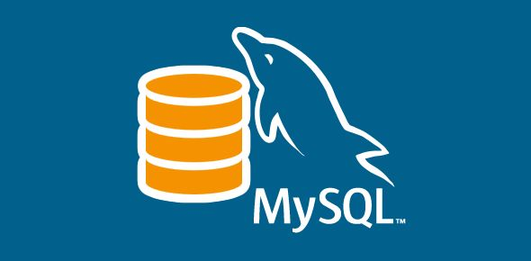

# MySQL DATABASE



## What is MySQL?

MySQL is an open-source relational database management system (RDBMS) that uses SQL (Structured Query Language) for defining and manipulating data. It is one of the most popular databases worldwide, known for its reliability, performance, and ease of use.

## Key Features:

- **Scalability:** MySQL can handle large amounts of data and scale horizontally with the use of replication.

- **Security:** Provides robust security features, including user authentication, access control, and data encryption.

- **Community Support:** Being open-source, MySQL has a vibrant community that contributes to its development and provides extensive support.

## Use Cases:

MySQL is suitable for various use cases, including:

- **Web Applications:** Many web applications use MySQL as their backend database for storing user data, configurations, and more.

- **Content Management Systems (CMS):** CMS platforms like WordPress, Joomla, and Drupal often rely on MySQL for data storage.

- **Business Applications:** MySQL is utilized in various business applications for managing and storing enterprise data.

## Getting Started:

To get started with MySQL:

1. **Installation:**
   - Follow the official [MySQL Installation Guide](https://dev.mysql.com/doc/mysql-installation-excerpt/8.0/en/) for your operating system.

2. **Connecting to MySQL:**
   - Use the MySQL command-line client or popular GUI tools like MySQL Workbench to connect to and interact with the database.

3. **Creating a Database:**
   - Start by creating a new database using SQL commands. For example:
     ```sql
     CREATE DATABASE mydatabase;
     ```

4. **Running Queries:**
   - Execute SQL queries to insert, update, retrieve, and delete data. For example:
     ```sql
     SELECT * FROM mytable;
     ```

## Resources:

- [MySQL Official Documentation](https://dev.mysql.com/doc/): Comprehensive documentation for MySQL.

- [MySQL Community Forums](https://forums.mysql.com/): Engage with the MySQL community for support and discussions.

- [MySQL on GitHub](https://github.com/mysql/mysql-server): Contribute to MySQL's development on GitHub.

---

Contact me via email to learn more at: igomigofatai@gmail.com
