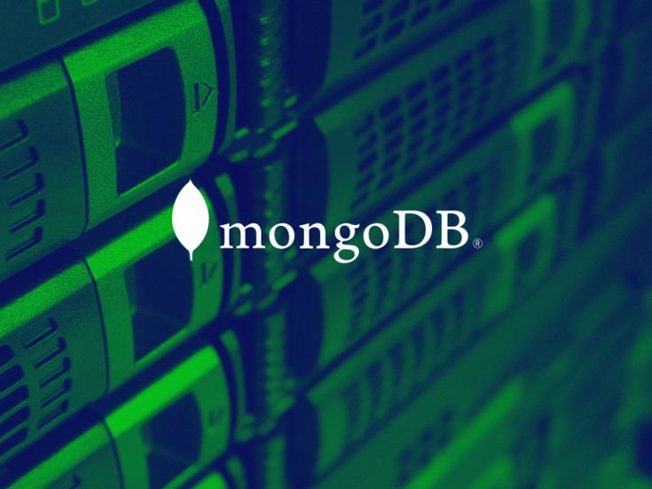

# MONGODB DATABASE



## What is MongoDB?

MongoDB is a NoSQL document-oriented database that provides high performance, scalability, and flexibility. It stores data in flexible, JSON-like BSON documents, making it suitable for a variety of use cases.

## Key Features:

- **Document-Oriented:** MongoDB stores data in flexible, JSON-like BSON documents, allowing for dynamic schemas and easy data modeling.

- **Scalability:** MongoDB scales horizontally by sharding, distributing data across multiple servers to handle large amounts of data.

- **Query Language:** MongoDB uses a rich and expressive query language for searching and retrieving data, supporting complex queries.

## Use Cases:

MongoDB is suitable for various use cases, including:

- **Big Data and Real-Time Applications:** MongoDB excels in handling large volumes of real-time data and is well-suited for big data applications.

- **Content Management Systems (CMS):** MongoDB is used in content-driven applications where flexible data models are essential.

- **Internet of Things (IoT):** MongoDB can store and process large amounts of data generated by IoT devices.

## Getting Started:

To get started with MongoDB:

1. **Installation:**
   - Follow the official [MongoDB Installation Guide](https://docs.mongodb.com/manual/installation/) for your operating system.

2. **Connecting to MongoDB:**
   - Use the `mongo` shell or popular GUI tools like MongoDB Compass to connect to and interact with the database.

3. **Creating a Collection:**
   - Start by creating a collection, which is a group of MongoDB documents. For example:
     ```javascript
     db.createCollection("mycollection");
     ```

4. **Inserting Documents:**
   - Add documents to the collection using MongoDB's flexible schema. For example:
     ```javascript
     db.mycollection.insert({ key: "value" });
     ```

## Resources:

- [MongoDB Official Documentation](https://docs.mongodb.com/): Comprehensive documentation for MongoDB.

- [MongoDB Community Forums](https://developer.mongodb.com/community/forums/): Engage with the MongoDB community for support and discussions.

- [MongoDB Atlas](https://www.mongodb.com/cloud/atlas): MongoDB's cloud-based database service for easy deployment and management.
