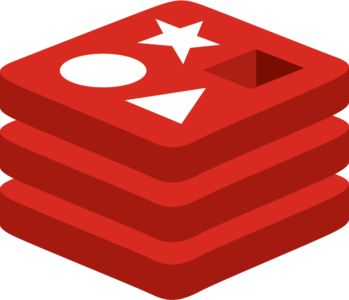

# Redis Database



Redis is an open-source, in-memory data structure store that can be used as a database, cache, and message broker. It provides high performance, scalability, and various data structures to store and manipulate data.

## Features

- **In-Memory Storage**: Redis stores data in memory, allowing for fast read and write operations.
- **Data Structures**: Redis supports various data structures such as strings, hashes, lists, sets, and sorted sets, providing flexibility in data modeling.
- **Caching**: Redis can be used as a cache to improve application performance by storing frequently accessed data in memory.
- **Pub/Sub Messaging**: Redis supports publish/subscribe messaging, allowing for real-time communication between different components of an application.
- **Persistence**: Redis offers different persistence options, including snapshotting and append-only file (AOF), to ensure data durability.
- **Scalability**: Redis supports clustering and replication, enabling horizontal scaling and high availability of data.

## Getting Started

To get started with Redis, follow these steps:

1. **Installation**: Install Redis on your system. You can find detailed installation instructions in the [official Redis documentation](https://redis.io/download).

2. **Configuration**: Configure Redis based on your requirements. The configuration file is usually located at `/etc/redis/redis.conf`. Adjust settings such as the port, memory limit, and persistence options according to your needs.

3. **Start Redis Server**: Start the Redis server by running the `redis-server` command. If Redis is properly installed and configured, the server should start successfully.

4. **Client Libraries**: Choose a client library for your preferred programming language to interact with Redis. Popular client libraries include redis-py for Python, redis-java for Java, and ioredis for Node.js. Refer to the documentation of your chosen client library for installation instructions and usage examples.

5. **Connect to Redis**: In your application code, establish a connection to the Redis server using the client library. Use the appropriate connection parameters such as host, port, and authentication credentials.

6. **Interact with Redis**: Use the client library's methods to perform operations such as storing and retrieving data, executing commands, and subscribing to channels in Redis.

## Example Usage

Here's a simple example in Python using the redis-py client library:

```python
import redis

# Connect to Redis
redis_client = redis.Redis(host='localhost', port=6379, password='your_password')

# Set a value
redis_client.set('my_key', 'my_value')

# Get a value
value = redis_client.get('my_key')
print(value)
